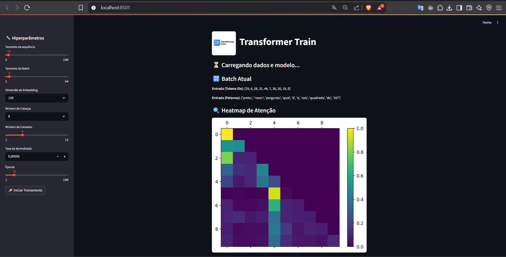
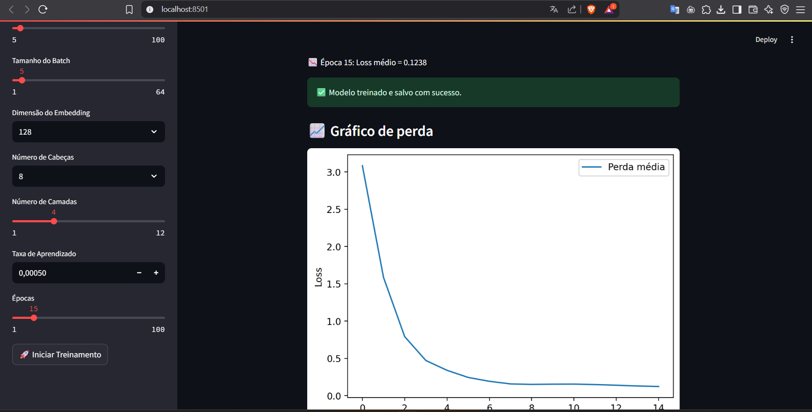
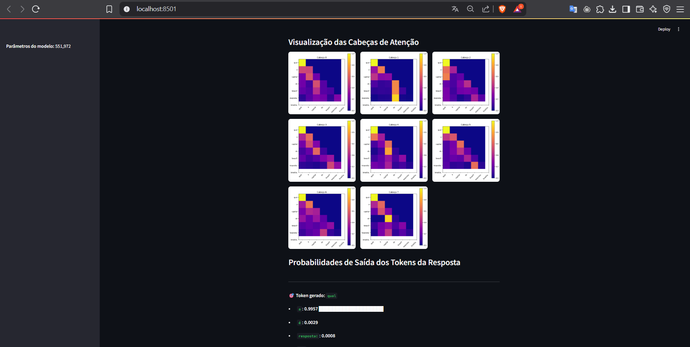

# 🧠 Transformer Core

**Transformer Core** é uma implementação educacional e compacta do Decoder da arquitetura Transformer, projetada para tarefas de NLP como geração de texto e perguntas/respostas. Leve, interpretável e pronta para personalização, ela é ideal para estudantes, entusiastas e experimentos locais.

<p align="center">
  
</p>

---

## ℹ️ O que é um Transformer?

Transformer é uma arquitetura de rede neural que mudou fundamentalmente a abordagem da Inteligência Artificial. Foi introduzida no artigo seminal "Attention is All You Need" em 2017 e desde então se tornou a principal arquitetura para modelos de deep learning, impulsionando modelos de geração de texto como o GPT da OpenAI, o Llama da Meta e o Gemini do Google. Além do texto, o Transformer também é aplicado na geração de áudio, reconhecimento de imagens, previsão de estrutura de proteínas e até em jogos, demonstrando sua versatilidade em diversos domínios.

Fundamentalmente, modelos Transformers de geração de texto operam com base no princípio de previsão da próxima palavra: dado um prompt textual do usuário, qual é a próxima palavra mais provável? A inovação central e o poder dos Transformers residem no uso do mecanismo de autoatenção (self-attention), que permite processar sequências inteiras e capturar dependências de longo alcance com mais eficácia do que arquiteturas anteriores.

A família GPT-2 é um exemplo proeminente do decoder da arquiterura Transformers para geração de texto. O Transformer Core se inspira nesses modelos e compartilha muitos dos mesmos componentes e princípios arquiteturais fundamentais encontrados nos modelos atuais de ponta, tornando-o ideal para aprendizado e compreensão básica.

---

## 🧬 Arquitetura Transformer

Todo Decoder da arquitetura Transformer é composto por três componentes principais:

* **Embedding**: A entrada textual é dividida em unidades menores chamadas *tokens*, que podem ser palavras ou subpalavras. Esses tokens são convertidos em vetores numéricos chamados *embeddings*, que capturam o significado semântico das palavras.

* **Bloco Transformer**: É o bloco fundamental do modelo que processa e transforma os dados de entrada. Cada bloco inclui:

  * **Mecanismo de Atenção (Attention Mechanism)**: permite que os tokens se comuniquem entre si, capturando informações contextuais e relações entre palavras.
  * **Camada MLP (Multilayer Perceptron)**: uma rede feed-forward que opera em cada token de forma independente. Enquanto a atenção roteia informações entre tokens, o MLP refina a representação de cada token.

* **Probabilidades de Saída**: As camadas finais lineares e softmax transformam os *embeddings* processados em probabilidades, permitindo que o modelo preveja o próximo token na sequência.


---

## 🧱 Arquitetura do Transformer Core

O `Transformer Core` é composto pelos seguintes blocos principais:

* **`Embedding`**: embedding de palavras e posições
* **`TransformerBlock`**: bloco completo com LayerNorm, residual e atenção + MLP
* **`MultiHeadSelfAttention`**: atenção com projeção conjunta QKV, máscara causal e concatenação de cabeças
* **`TransformerMLP`**: MLP com GELU e projeções lineares
* **`SimpleTransformer`**: empilhamento de blocos, seguido por uma projeção linear para logits

Exemplo de configuração:

```python
model = SimpleTransformer(
    vocab_size=len(vocab),
    embed_dim=128,
    num_heads=8,
    num_layers=4
)
```
---

## 🚀 Recursos

* Arquitetura Transformer simplificada com PyTorch puro
* Camada de atenção multi-cabeça (multi-head self-attention)
* Conexões residuais com normalização e MLP
* Projeções integradas de Q, K e V
* Geração de texto com temperatura, top-k e top-p
* Dataset estilo QA baseado em texto plano

---

## 📁 Estrutura do projeto

```bash
transformer_core_project/
├── transformer_app_playground   # App Playground
├── transformer_train   # App Transforme Train 
├── model.py                # Arquitetura do Transformer Core
├── train_transformer.py  # Script de treino e geração via terminal
├── textDataset.txt        # Dados de treinamento com pares QA
├── modelo_transformer.pt  # Modelo treinado
├── vocab_transformer.json # Vocabulário serializado
├── TransformerCoreTreino.ipynb  # Versão notebook interativo
├── requirements.txt # Dependências 
└── transformer_app.py # Web App Playground interativo

```

---

## 🏁 Como Instalar, Usar e Treinar um Modelo

```bash
# Criar e ativar o ambiente virtual
python -m venv myenv
.\myenv\Scripts\activate

# Instalar as Depedências
pip install torch streamlit numpy pillow matplotlib
ou
pip install -r requirements.txt

# Rodar app Playground 
cd transformer_app_playground
streamlit run main.py

# Rodar app Transformer Train
cd transformer_train
streamlit run train_transformer_app.py
ou
# Treinar modelo via terminal
python train_transformer.py
```

---

## 📌 Transformer Train

O app Transformer Train é responsável por **treinar um modelo Transformer simples** para tarefas de geração de texto com base em pares de pergunta e resposta. Ele segue uma arquitetura compacta e educacional, ideal para fins de aprendizado, prototipagem e experimentação.
<p align="center">
  
</p>

<p align="center">
  
</p>

### 🎛️ Funcionalidades:

- **Pré-processamento do dataset** (`textDataset.txt`).
- **Definição do modelo Transformer** com número ajustável de camadas, cabeças, embeddings.
- **Treinamento supervisionado** com otimização via `Adam` e `cross_entropy`.
- **Salvamento dos pesos do modelo** e vocabulário treinado.
- **Geração de texto** a partir de um prompt, usando top-k e top-p sampling.
- **Geração de gráfico**: um gráfico com a curva de perda (loss) para facilitar a análise do desempenho do modelo.
- **Exibe o batch atual**: mostra os tokens numéricos e as palavras reais.
- **Gera um heatmap da atenção**: gera um heatmap da atenção da última camada e primeira cabeça de atenção.
- **Exibe a loss**: Exibe a loss média a cada época.
- **Atualiza o progresso batch**: Atualiza o progresso batch a batch em tempo real.

---

## 💬 Playground Web App

O projeto inclui uma interface interativa desenvolvida com Streamlit chamada **Playground**, que permite explorar e testar o modelo treinado pelo Transformer Train diretamente no navegador.
O modelo treinado é salvo no modelo_transformer.pt. Para usar o modelo treinado basta copiar o modelo_transformer.pt para a pasta transformer_app_playground.

<p align="center">
  
</p>
<p align="center">
  
</p>
A interface é intuitiva e oferece os seguintes recursos:

* Entrada de texto para perguntas abertas
* Sliders interativos para configurar os parâmetros da geração:

  * Número de palavras a gerar
  * Temperatura (controla a aleatoriedade)
  * Top-k (seleção dos k tokens mais prováveis)
  * Top-p (nucleus sampling, controle de diversidade)
* Visualização clara da resposta gerada
* Exibição lateral do número total de parâmetros do modelo

Essa interface é ideal para testes rápidos e demonstrações, permitindo que estudantes e entusiastas compreendam na prática como os ajustes de parâmetros afetam a saída do modelo.

---

## ✨ Exemplo de uso

```text
prompt: pergunta: quanto é 2 mais 2? resposta:
output: 4 <eos>
```

---

## 📚 Referências

* [Attention Is All You Need](https://arxiv.org/abs/1706.03762)
* [The Annotated Transformer](http://nlp.seas.harvard.edu/annotated-transformer/)
* Baseado em práticas de modelos como GPT-2

---

## 📘 Créditos

📘 **Transformer Core** foi desenvolvido pelo Prof. [Fabio Santos](https://www.linkedin.com/in/fabio-santos-3706906/), com foco em ensino, prototipagem e experimentação de modelos de linguagem baseados na arquitetura Transformer.

---

## ⚠️ Licença e Uso

Este projeto é distribuído exclusivamente para **fins educacionais e não comerciais**.  
O uso é permitido para estudo, pesquisa e prototipagem, com a devida atribuição de crédito ao autor.  
Qualquer uso comercial ou redistribuição requer permissão prévia por escrito.

Licença adaptada da [MIT License](https://opensource.org/licenses/MIT).
