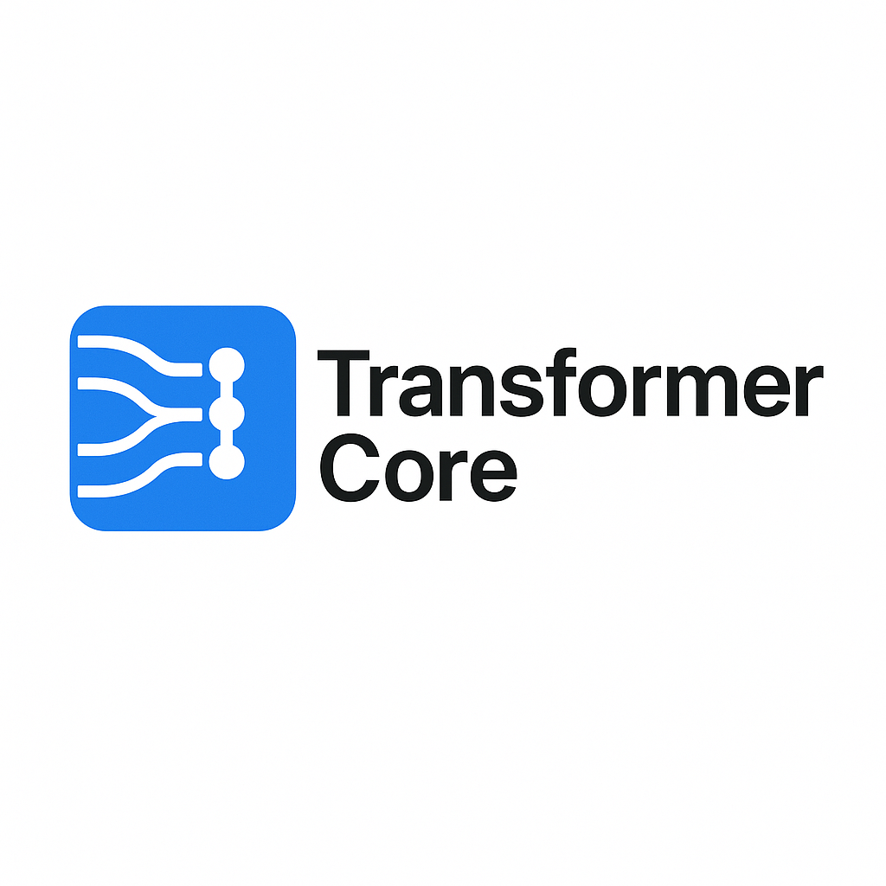

# 🧠 Transformer Core

**Transformer Core** é uma implementação educacional e compacta da arquitetura Transformer, projetada para tarefas de NLP como geração de texto e perguntas/respostas. Leve, interpretável e pronta para personalização, ela é ideal para estudantes, entusiastas e experimentos locais.

<p align="center">
  
</p>

---

## ℹ️ O que é um Transformer?

Transformer é uma arquitetura de rede neural que mudou fundamentalmente a abordagem da Inteligência Artificial. Foi introduzida no artigo seminal "Attention is All You Need" em 2017 e desde então se tornou a principal arquitetura para modelos de deep learning, impulsionando modelos de geração de texto como o GPT da OpenAI, o Llama da Meta e o Gemini do Google. Além do texto, o Transformer também é aplicado na geração de áudio, reconhecimento de imagens, previsão de estrutura de proteínas e até em jogos, demonstrando sua versatilidade em diversos domínios.

Fundamentalmente, modelos Transformers de geração de texto operam com base no princípio de previsão da próxima palavra: dado um prompt textual do usuário, qual é a próxima palavra mais provável? A inovação central e o poder dos Transformers residem no uso do mecanismo de autoatenção (self-attention), que permite processar sequências inteiras e capturar dependências de longo alcance com mais eficácia do que arquiteturas anteriores.

A família GPT-2 é um exemplo proeminente de Transformers para geração de texto. O Transformer Core se inspira nesses modelos e compartilha muitos dos mesmos componentes e princípios arquiteturais fundamentais encontrados nos modelos atuais de ponta, tornando-o ideal para aprendizado e compreensão básica.

---

## 🧬 Arquitetura Transformer

Todo Transformer de geração de texto é composto por três componentes principais:

* **Embedding**: A entrada textual é dividida em unidades menores chamadas *tokens*, que podem ser palavras ou subpalavras. Esses tokens são convertidos em vetores numéricos chamados *embeddings*, que capturam o significado semântico das palavras.

* **Bloco Transformer**: É o bloco fundamental do modelo que processa e transforma os dados de entrada. Cada bloco inclui:

  * **Mecanismo de Atenção (Attention Mechanism)**: permite que os tokens se comuniquem entre si, capturando informações contextuais e relações entre palavras.
  * **Camada MLP (Multilayer Perceptron)**: uma rede feed-forward que opera em cada token de forma independente. Enquanto a atenção roteia informações entre tokens, o MLP refina a representação de cada token.

* **Probabilidades de Saída**: As camadas finais lineares e softmax transformam os *embeddings* processados em probabilidades, permitindo que o modelo preveja o próximo token na sequência.


---

## 🧱 Arquitetura do Transformer Core

O `Transformer Core` é composto pelos seguintes blocos principais:

* **`Embedding`**: embedding de palavras e posições
* **`TransformerBlock`**: bloco completo com LayerNorm, residual e atenção + MLP
* **`MultiHeadSelfAttention`**: atenção com projeção conjunta QKV, máscara causal e concatenação de cabeças
* **`TransformerMLP`**: MLP com GELU e projeções lineares
* **`SimpleTransformer`**: empilhamento de blocos, seguido por uma projeção linear para logits

Exemplo de configuração:

```python
model = SimpleTransformer(
    vocab_size=len(vocab),
    embed_dim=128,
    num_heads=8,
    num_layers=4
)
```
---

## 🚀 Recursos

* Arquitetura Transformer simplificada com PyTorch puro
* Camada de atenção multi-cabeça (multi-head self-attention)
* Conexões residuais com normalização e MLP
* Projeções integradas de Q, K e V
* Geração de texto com temperatura, top-k e top-p
* Dataset estilo QA baseado em texto plano

---

## 📁 Estrutura do projeto

```bash
transformer_chatbot_project/
├── model.py                # Arquitetura do Transformer Core
├── train_transformer.py  # Script de treino e geração
├── textDataset.txt        # Dados de treinamento com pares QA
├── modelo_transformer.pt  # Modelo treinado
├── vocab_transformer.json # Vocabulário serializado
├── TransformerChatbotTreino.ipynb  # Versão notebook interativo
└── transformer_app # Web app interativo

```

---

## 🏁 Como usar

```bash
pip install torch streamlit numpy
ou
pip install -r requirements.txt

# Treinar modelo
python train_transformer.py

# Rodar app Streamlit (caso implementado)
streamlit run transformer_app.py
```

---

## 📌 Parâmetros típicos

* Camadas: 4
* Cabeças de atenção: 8
* Embedding: 128
* Hidden MLP: 256
* Tokens máximos por prompt: 100
* Parâmetros totais: \~806.000

---

## ✨ Exemplo de uso

```text
prompt: pergunta: quanto é 2 mais 2? resposta:
output: 4 <eos>
```

---

## 📚 Referências

* [Attention Is All You Need](https://arxiv.org/abs/1706.03762)
* [The Annotated Transformer](http://nlp.seas.harvard.edu/2018/04/03/attention.html)
* Baseado em práticas de modelos como GPT-2

---

Desenvolvido para aprendizado, prototipagem e experimentação.

> "Construa seu próprio modelo, compreenda cada atenção."
